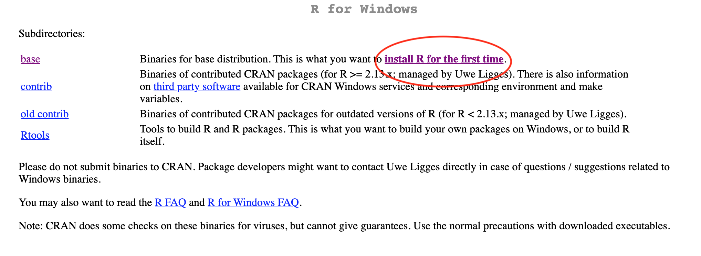

# (PART) R Basics {-} 

# Getting Started with R
> This chapter will walk through the steps of getting started with R and RStudio. At the end of the chapter, we'll provide a link where you can download a folder that includes all of the code and data that's used in this guidebook.

## What is R? {-}
R is an open-source, free software environment for data manipulation and statistical computing. Here is an excerpt from the R website (<https://www.r-project.org>):

> *The term “environment” is intended to characterize R as a fully planned and coherent system, rather than an incremental accretion of very specific and inflexible tools, as is frequently the case with other data analysis software.*

A programming language offers more flexibility than other data analysis tools like Excel and SPSS, but the benefit of flexibility comes with the cost of complexity. The learning curve of R is steeper than Excel and SPSS, but once you get the hang of it, R can streamline and simplify many tasks. Have you ever needed to copy and paste many data files together into one "master" file? This method is both error-prone and  time-consuming. A task like this can be accomplished in a few lines of code in R, and the code can then used as a template for performing the same kind of task in the future. This is just one example, but R can be used for many other time-consuming tasks like this. The sky is the limit!

## Installing R {-}

### Step 1 {-}
Go to the R website (<https://www.r-project.org/>) and click on the **download R** link that's circled below.  

```{r echo=FALSE, cache=TRUE, out.height= '80%', out.width= '80%', fig.align='center'}
setwd("..")

```

### Step 2 {-}
You'll then be redirected to a page that looks like this. If you you scroll down you'll see several USA locations listed. Click on one of those links (it doesn't matter which one you choose. For example, I chose the St. Louis location).

```{r echo=FALSE, cache=TRUE, out.height= '80%', out.width= '80%', fig.align='center'}
setwd("..")
knitr::include_graphics("./images/r_mirror.png")
```

### Step 3 {-}
Now click on the download link that is relevant to your operating system.

```{r echo=FALSE, cache=TRUE, out.height= '80%', out.width= '80%', fig.align='center'}
setwd("..")
knitr::include_graphics("./images/r_download.png")
```

### Step 4: Mac users {-}
If you're a mac user, you'll see this screen next. The version of R you download will depend on which version of software your mac is running. At the time of writing this, the latest R release is **R 4.0.0** which is for mac 10.13 OS (High Sierra) and higher. If you have an older version of mac software, you can download an older version of R from the same page.

```{r echo=FALSE, cache=TRUE, out.height= '80%', out.width= '80%', fig.align='center'}
setwd("..")

```

### Step 4: Windows users {-}
If you're a windows user you'll see this screen next, where you'll want to click on the "install R for the first time" link. 

```{r echo=FALSE, cache=TRUE, out.height= '80%', out.width= '80%', fig.align='center'}
setwd("..")

```

You can then download R by clicking on this link. The exact version will likely be different than the one shown here.

```{r echo=FALSE, cache=TRUE, out.height= '80%', out.width= '80%', fig.align='center'}
setwd("..")
knitr::include_graphics("./images/r_download_win2.png")
```


## What is RStudio? {-}
Simply put, RStudio IDE is an environment that makes working with R much less painful. "IDE" stands for integrated development environment. Without RStudio, R looks something like this:

```{r echo=FALSE, cache=TRUE, out.height= '80%', out.width= '80%', fig.align='center'}
setwd("..")

```

As you can see it's a disorganized mess. The RStudio IDE cleans up the R interface so that it's much cleaner and easier to work with, like this:

```{r echo=FALSE, cache=TRUE, out.height= '80%', out.width= '80%', fig.align='center'}
setwd("..")

```

You don't *need* to use RStudio, but we highly recommend that you do because it significantly improves the user experience.

## Installing RStudio {-}
Go to the RStudio website (<https://rstudio.com/>) and click the download button. Then scroll down and click on the download link that is relevant to your operating system.

```{r echo=FALSE, cache=TRUE, out.height= '80%', out.width= '80%', fig.align='center'}
setwd("..")
knitr::include_graphics("./images/rstudio_download.png")
```

## Opening R or RStudio {-}
If you decided not to download RStudio, then you'll work with R by opening the R application. It's perfectly fine to do this, but just know that you'll be on your own! The rest of this book will assume you've installed RStudio, and we'll occasionally make references that are specific to the RStudio interface.

If you downloaded RStudio, you'll work with R by opening RStudio. In this case, you should *not* open R, because RStudio is simply an interface for R; by using RStudio you are simultaneously using R. So, if you were to open both R and RStudio, you would be starting two separate R sessions, which is not what you want to do. Hopefully that makes sense. 

Now would be a good time to open RStudio and start following along. 

## The RStudio Layout {-}
By default, RStudio uses the 4 pane layout shown below.

```{r echo=FALSE, cache=TRUE, out.height= '80%', out.width= '80%', fig.align='center'}
setwd("..")

```

* **Pane A**: This is where you write your scripts. You can think of a script like a notepad, where you can write your code and then save it for later.

* **Pane B**: This is where your code is "analyzed", and specifically it is analyzed under the `Console` tab (you can ignore the `Terminal` tab). For example, if you wanted to calculate the mean of 3 numbers, like this `mean(c(12, 32, 15))`, the result, `r {round(mean(c(12, 32, 15)), digits=1)}`, would be displayed in this pane under the `Console` tab. You can also *write* code here. For example, you could write `mean(c(12, 32, 15))` directly into the console (instead of in Pane A), but keep in mind that **any code that is typed here will not be saved.**

* **Pane C**: This pane has several tabs, but the only one that really matters is the `Enironment` tab (if you don't see a `Build` or `Git` tab, that's okay). The `Environment` tab is where you can view your data and the objects you create, which will make more sense as you progress through the book.

* **Pane D**: In this pane you can view files, plots, install packages, get help with R functions and more. 

## Following Along {-}
We wanted to make it as easy as possible to follow along with this guidebook, so we created a folder that contains all of the data and code that's used throughout the chapters, which can be downloaded [here](https://github.com/JasonDude16/Statistical-Analysis-Folder). After clicking on the link, you should see a page that has a green **Clone or download** button, shown below. 

```{r echo=FALSE, cache=TRUE, out.height= '80%', out.width= '80%', fig.align='center'}
setwd("..")

```

You can then click on the dropdown arrow on the green button and click **Download ZIP**. Next, find the folder on your computer, unzip it, and move it to a convenient location (such as your Desktop). If you currently have an R session open, go ahead and close it. After you've closed your current R session, open the file within the folder that ends with the extension **.Rproj**. After you click on the **Rproj** file, RStudio should open and you should see a screen similar to the one below. 

> By opening the .Rproj file, we opened an R project. There's nothing particularly "special" about an R project; all it really does is set the working directory to the correct location, which will make more sense after reading Chapter 4. 

```{r echo=FALSE, cache=TRUE, out.height= '80%', out.width= '80%', fig.align='center'}
setwd("..")
knitr::include_graphics("./images/rstudio-project.png")
```

## Opening a Script {-}
You can open a script in R by clicking on the dropdown arrow next to the white piece of paper with a green plus sign that's located in the upper left corner. Then click on **R Script**. 

```{r echo=FALSE, cache=TRUE, out.height= '80%', out.width= '80%', fig.align='center'}
setwd("..")
knitr::include_graphics("./images/rstudio-script.png")
```

You should now see a new pane added to the upper left section of your screen, which is the R script.

```{r echo=FALSE, cache=TRUE, out.height= '80%', out.width= '80%', fig.align='center'}
setwd("..")
knitr::include_graphics("./images/rstudio-script2.png")
```

Let's add a comment to the script so it's no longer blank:

```{r eval=FALSE}
# This is my first R script
```

## Saving a Script {-}
You can then save the script by clicking on `File > Save as`, and navigating to the folder you'd like to save it in. 

