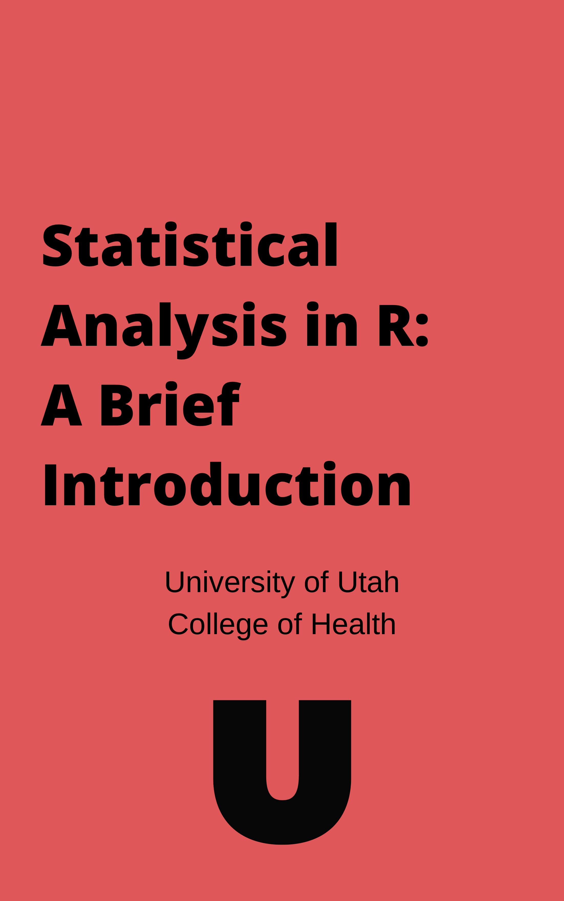

```{r setup_index, include=FALSE}
knitr::opts_chunk$set(echo = T, comment= '', results = 'hold', warning = F, message = F, fig.align = 'center')
knitr::opts_knit$set(root.dir = './data')
```

```{r}
library(dplyr)
library(knitr)
library(kableExtra)
```

# Welcome {-}

```{r, echo=FALSE, out.height= '50%', out.width= '50%', cache=TRUE, fig.align='left'}
setwd("..")

```

The purpose of this guidebook is to provide a brief introduction to performing statistical analysis in R, and it is intended for a reader who 1) Is knowledgeable about statistical analysis and is selecting the appropriate statistical model for whatever research question they would like to answer, and 2) Is unsure of how to perform the analysis in R, and is unfamiliar with programming languages in general. 

We tried to make this book as brief as possible while still providing all of the necessary information to get up and running with R. The book is sequential and builds on knowledge from prior chapters, and, as such, we recommended reading it in order. Chapters 1 and 2 will cover downloading and describing R and the RStudio IDE, as well as programming basics, such as variable types and data types, objects and assignments, and functions and arguments. Chapters 3 and 4 will cover installing/loading packages and reading/writing files. Chapters 5 and 6 will cover descriptive statistics, visualizing data, and formatting data. Chapters 7-13 will cover various statistical models from the General Linear Model framework. 

<!--
# Functions List{-}
Below are a few common functions that may be helpful for future reference.

```{r, eval=FALSE}
# GET HELP ON TOPICS / WITH FUNCTIONS
help()

# READ CSV FILE
read.csv()

# READ TEXT FILE
read.delim()

# INSTALL PACKAGES
install.packages()

# LOAD PACKAGES
library()

# PRINT FIRST FEW ROWS OF DATA
head()

# PRINT LAST FEW ROWS OF DATA
tail()

# PRINT STRUCTURE OF DATA
str()

# DESCRIPTIVE STATISTICS
mean()
sd()
summary()
cor()
var()
is.na()

# CORRELATION MATRIX 
rcorr() # Package required: Hmisc

# PAIRWISE PARTIAL CORRELATION
ppcor::pcor() # Package required: ppcor

# VISUALIZE DATA 
plot()
hist()

# SHAPIRO-WILK NORMALITY TEST
shapiro.test()

# LINEAR MODEL
lm()

# STUDENT'S T-TEST
t.test()

# ANALYSIS OF DATA FROM FACTORIAL EXPERIMENTS
ezANOVA() # Package requried: ez

# ANALYSIS OF VARIANCE (MODEL COMPARISON)
aov()
```
-->

# Resources {-} 

```{r, echo=FALSE}
dt_url = c("https://swirlstats.com/students.html",
           "https://stackoverflow.com/",
           "https://www.statmethods.net/r-tutorial/index.html",
           "https://bookdown.org/rdpeng/rprogdatascience/")

Name = c("Swirl",
         "StackOverflow",
         "Quick R by Datacamp",
         "R Programming for Data Science")

ref_table <- 
tibble::tibble(
    
    Link = cell_spec(Name, "html", link = dt_url),
    
    Description = c("Swirl is an R package where you can learn and practice R,                     in R. Click on the link provided to learn more about                           installing and using swirl. ",
                    
                    "Need help with R? Stackoverflow is a website for                              posting programming related questions.", 
                    
                    "Quick R by Datacamp is a webpage where the content is very                     simmilar to that of this guidebook: short and to the point,
                    but still covering everything from installing R to
                    statistics.", 
                    
                    "R Programming for Data Science is a comprehensive                             introduction to R and data analysis written by Roger D.                        Peng, a professor of Biostatistics at the Johns Hopkins                        Bloomberg School of Public Health.")
)

kable(ref_table, "html", escape = FALSE) %>%
kable_styling(bootstrap_options = c("hover", "condensed")) 

# OTHER WEBSITES
# <https://rstudio-education.github.io/hopr/>
# <https://bookdown.org/rdpeng/rprogdatascience/>
# <https://www.statmethods.net/r-tutorial/index.html>
# <http://www.sthda.com/english/wiki/r-basics-quick-and-easy> 
# <https://stackoverflow.com/>
# <https://r4ds.had.co.nz/>
# <https://www.r-bloggers.com/>
# <https://learn.datacamp.com/>
# http://r-statistics.co/R-Tutorial.html
```
