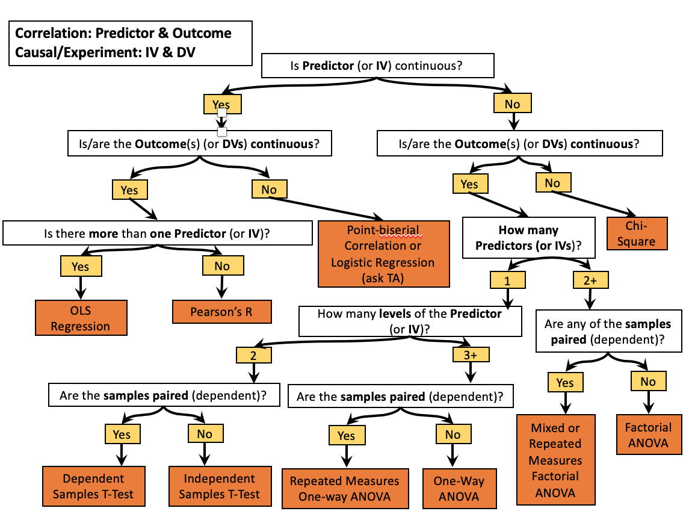

```{r setup_index, include=FALSE}
knitr::opts_chunk$set(echo = T, comment= '', results = 'hold', warning = F, message = F, fig.align = 'center')
```

# Welcome {-}

```{r, echo=FALSE, out.height= '50%', out.width= '50%', cache=TRUE, fig.align='left'}
knitr::include_graphics("images/book_cover.png")
```

The purpose of this book is to provide a brief introduction to performing statistical analysis in R. It is assumed that the reader is selecting the appropriate statistical model for whatever research question they would like to answer, but they are unsure of how to perform the analysis in R. Consequently, statistical theory will not be covered in this book. It is also assumed that the reader is enirely unfamiliar with programming languages and concepts. Before delving into the various statstical models, a concise overview of programming concepts will be covered, so that hopefully the reader will feel comfortable with modifying and extending on example code to suit their analytic endeavors.

Chapters 1 and 2 will cover downloading and describing R and the RStudio IDE (what even is an IDE?), and programming basics, such as data types and data structures, objects and assignments, and functions and arguments. Chapters 3 and 4 will cover installing/importing packages (what is a package and why do I need it?), importing data, and formatting the data in a way that is conducive to analysis. Chapters 5 and 6 will briefly cover descriptive statistics, quality assurance, and visualizing data. Chapters 7-13 will cover various statistical tests that all fall under the GLM umbrella.  

# Statistical Model Flowchart {-}

```{r, echo=FALSE, fig.align="center", fig.width=3, cache=TRUE}

```

Above is a statistical test flowchart that can help you decide which model is most appropriate for your analysis. Again, this book will not cover statistical theory or when it's most appropriate to select a certain model, but this flowchart can still serve as a handy reference while reading this book. 

# Functions List{-}

```{r, eval=FALSE}
install.packages()
library()

head()
tail()
str()

mean()
sd()
summary()

plot()

ez::ezANOVA()
cor()
cor.test()
Hmisc::rcorr()
ppcor::pcor()
var()
kurtosis()
skewness()
shapiro.test()
help()

# Linear Model
lm()

# Student's t-test
t.test()

# Analysis of Variance
aov()
```

# Resources {-} 

```{r, echo=FALSE, cache=TRUE}
library(dplyr)
library(knitr)
library(kableExtra)

dt_url = c("https://swirlstats.com/students.html",
           "https://stackoverflow.com/",
           "https://www.statmethods.net/r-tutorial/index.html",
           "https://bookdown.org/rdpeng/rprogdatascience/")

Name = c("Swirl",
         "StackOverflow",
         "Quick R by Datacamp",
         "R Programming for Data Science")

ref_table <- 
tibble::tibble(
    
    Link = cell_spec(Name, "html", link = dt_url),
    
    Description = c("Swirl is an R package that you can use to learn R in R.",
                    
                    "Need help with R? Stackoverflow is a website where you can                     post programming related questions", 
                    
                    "Quick R by Datacamp is a webpage where the content is very                     simmilar to that of this guidebook: short and sweet, but                        still covering everything from install R to statistics.", 
                    
                    "R Programming for Data Science is a comprehensive                              introduction to R and data analysis.")
)

kable(ref_table, "html", escape = FALSE) %>%
kable_styling(bootstrap_options = c("hover", "condensed")) 

# <https://rstudio-education.github.io/hopr/>
# <https://bookdown.org/rdpeng/rprogdatascience/>
# <https://www.statmethods.net/r-tutorial/index.html>
# <http://www.sthda.com/english/wiki/r-basics-quick-and-easy> 
# <https://stackoverflow.com/>
# <https://r4ds.had.co.nz/>
# <https://www.r-bloggers.com/>
# <https://learn.datacamp.com/>
    
```
